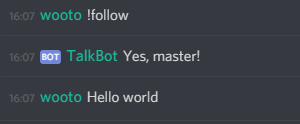

# Speaking without a command

### Command-less text to speech: speak without !tts

A common way for bots to implement text to speech is to create a !tts command. Talkbot has this capability but it is only really required when you've intentionally muted yourself using !mute.

When you _!follow_ the bot will read out any text you type anywhere in the server unless it's a command or you've muted yourself. This makes it quite useful in the situation where you want to have a lengthly conversation with someone and don't want the frustration of remembering to use the !tts command.

The following example will get the bot to follow and then speak hello world in the active voice channel:



This has an inverse problem of sometimes you don't want your text to be read out by the bot. There's three approaches to preventing your text being read out: **!mute**, **!&lt;space&gt;** or **!restrict**

### !mute

The mute command will mute you or another user from having their text read out by Talkbot. This user can still use !tts to have text read out, however the default behavior will not read out their text when a user is muted.

A user can mute themselves or a user with server management permissions can mute other users.

Examples**:**

```text
Mute yourself: 
    !mute
    
Mute another user: 
    !mute @faxo
    
 Unmute yourself:
     !unmute
     
Unmute another user:
    !unmute @faxo 
```

### !&lt;space&gt;&lt;my text&gt;

For a simple inline way for your text to not be read out simply use the command char **! and a space** and then the bot will ignore this text.

Example:

```text
! text I don't want read out by Talkbot
```

### !restrict

A full discussion of this can be seen at this [page](restrict-text-messages-to-a-channel.md)


Only a user with server admin permissions or server management permissions can perform this command.


On some servers you may want to restrict text-to-speech activities to a single channel or a few channels. This can be done using **!restrict**.

To restrict text to speech to a specific channel:

```text
!restrict #text-to-speech
```

 Once this is done, Talkbot will only look for messages to be read out from this channel. Talkbot will still read commands from any channel. 

Restrict can also restrict Talkbot to multiple channels by calling restrict multiple times or chaining the channels together when running the command. For example to restrict Talkbot to reading from two channels, \#tts-team1 and \#tts-team2:

```text
!restrict #tts-team1 #tts-team2
```

If you'd like to unrestrict Talkbot use the 'none' special channel:

```text
!restrict none
```

To see the channels Talkbot is restricted to:

```text
!restrict
```


